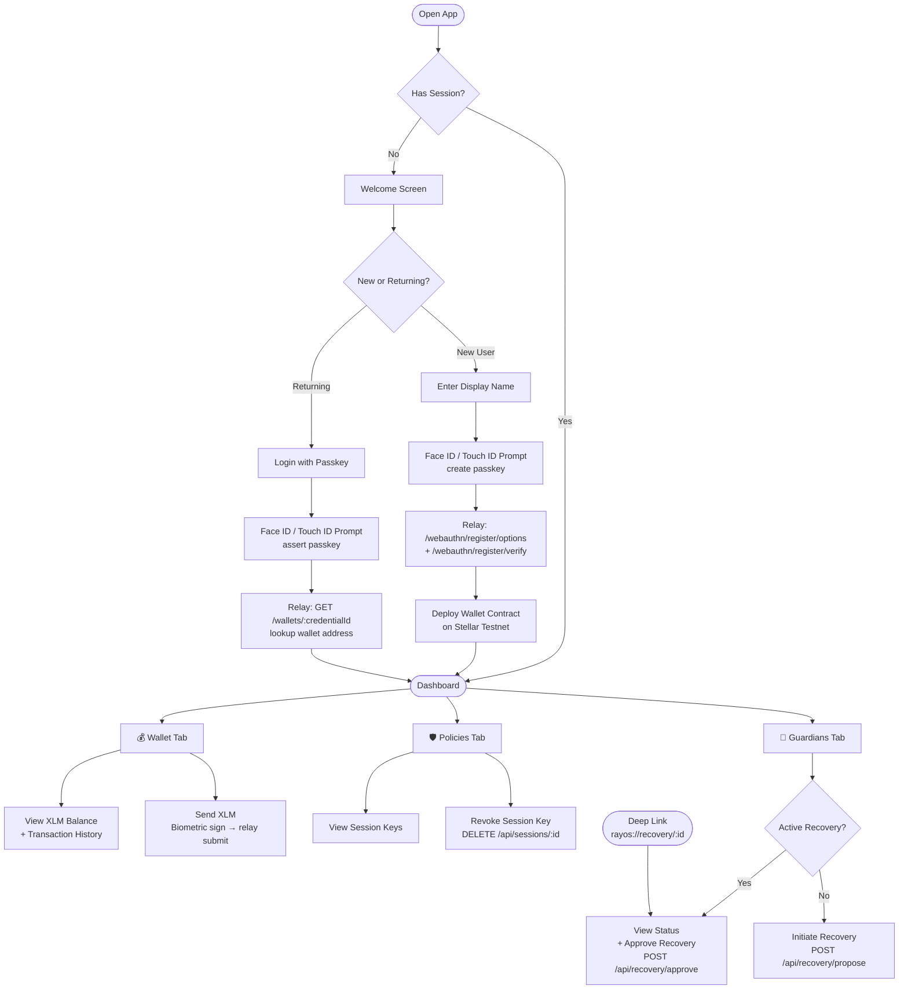

<div align="center">


# Rayos — Mobile Wallet

### Passkey-secured, seedless smart wallet for iOS & Android
### Built on Stellar · Powered by Soroban smart contracts

<br/>

[](https://docs.expo.dev/versions/v57.0.0/)
[](https://reactnative.dev/)
[](https://www.typescriptlang.org/)
[](https://tanstack.com/query)
[](https://stellar.org/)
[](https://expo.dev/eas)
[](https://github.com/Rayos-Org/mobile-app/actions)
[](LICENSE)

<br/>

**[📱 Download Preview Build](#)** &nbsp;·&nbsp;
**[🌐 Web Dashboard](https://github.com/Rayos-Org/web-dashboard)** &nbsp;·&nbsp;
**[📖 Docs](docs/)** &nbsp;·&nbsp;
**[🐛 Report Bug](https://github.com/Rayos-Org/mobile-app/issues/new?template=bug_report.yml)** &nbsp;·&nbsp;
**[✨ Request Feature](https://github.com/Rayos-Org/mobile-app/issues/new?template=feature_request.yml)**

> 🚀 **Preview Build:** _Deployment link coming soon — follow the repo to be notified._

</div>

---

## What is Rayos?

Rayos is a **seedless, self-custodial smart wallet** on the Stellar network. There are no seed phrases — your keys live in your device's Secure Enclave (iOS) or StrongBox (Android), protected by Face ID, Touch ID, or biometrics. The on-chain wallet is a Soroban smart contract that verifies WebAuthn signatures directly, meaning you get the security of passkeys with the programmability of smart contracts.

This repository is the **native mobile app** — the most polished way to experience the passkey UX. It is feature-equivalent to the [`web-dashboard`](https://github.com/Rayos-Org/web-dashboard) but passkeys on a real phone, unlocked by your face, are where the "no seed phrase" pitch really lands.

---

## The Rayos Ecosystem

This app is one piece of a larger open-source system. Here's how the repos connect:

| Repo | Role | How mobile uses it |
|---|---|---|
| **`mobile-app`** ← *you are here* | Native iOS & Android app | — |
| [`wallet-sdk`](https://github.com/Rayos-Org/wallet-sdk) | Shared TypeScript SDK | `file:../wallet-sdk` — `WalletSdk` class, `PasskeyProvider` interface, all types |
| [`relay-backend`](https://github.com/Rayos-Org/relay-backend) | NestJS gasless relay API | All HTTP calls: WebAuthn, relay, sessions, recovery, `.well-known` files |
| [`wallet-contracts`](https://github.com/Rayos-Org/wallet-contracts) | Soroban smart contracts (Rust) | Indirect — JS bindings consumed through `wallet-sdk` |
| [`web-dashboard`](https://github.com/Rayos-Org/web-dashboard) | Next.js web app | Design token parity; same conceptual API contract |
| [`infra`](https://github.com/Rayos-Org/infra) | GitHub Actions, Docker, env specs | EAS build workflow reused; env variable naming convention |

---

## Features

| Feature | Details |
|---|---|
| 🔑 **Passkey Wallet Creation** | Register with Face ID / Touch ID — no seed phrase, no password. Deploys a Soroban smart contract on Stellar automatically. |
| 🔐 **Native Biometric Signing** | Every transaction is approved by your biometric. The passkey never leaves the device Secure Enclave. |
| 💸 **Send & Receive XLM** | Send Stellar assets with a biometric confirmation. Transaction history pulled live from Horizon. |
| 🛡️ **Spend Limits** | Set rolling per-token spend limits enforced on-chain by the Policy contract. |
| 🔑 **Session Keys** | Create scoped, time-limited session keys for specific dapps or automations. |
| 👥 **Social Recovery** | Add guardian addresses. If you lose your device, 2-of-N guardians can approve a new passkey — with a 48-hour timelock. |
| 📲 **Deep Link Recovery Approval** | Guardians receive an email link; tapping it on mobile opens the app directly on the approval screen. |
| 🌙 **System / Light / Dark Theme** | Follows OS by default; user can override in Settings. Choice is persisted securely. |
| 📡 **Offline-first** | TanStack Query with `networkMode: offlineFirst` — pending state is clear, retries happen automatically. |

---

## Repository Structure

```
mobile-app/
│
├── app/                              ← expo-router file-based routes
│   ├── _layout.tsx                   ← Root: QueryClient, deep-link handler, auth gate
│   ├── +not-found.tsx
│   ├── (onboarding)/                 ← Unauthenticated group (Stack)
│   │   ├── index.tsx                 ← Welcome / landing screen
│   │   ├── create.tsx                ← Passkey registration → wallet deployment
│   │   ├── login.tsx                 ← Passkey assertion → wallet lookup
│   │   └── recover.tsx               ← Initiate guardian recovery
│   ├── (dashboard)/                  ← Authenticated group (Tabs)
│   │   ├── wallet.tsx                ← Balance · send · receive · activity
│   │   ├── policies.tsx              ← Spend limit · session keys · allow-list
│   │   ├── guardians.tsx             ← Guardians · threshold · active recovery
│   │   └── settings.tsx             ← Theme · app info · sign out
│   └── recovery/[proposalId].tsx     ← Guardian approval (deep-link target)
│
├── components/
│   ├── ui/                           ← Design system: Button, Card, Input, Sheet, Toast…
│   ├── layout/                       ← TabBar, ThemeSwitch, OnboardingHeader, StepDots
│   ├── wallet/                       ← BalanceCard, TransactionList, SendSheet, SignerList
│   ├── policies/                     ← SpendLimitCard, SessionKeysCard, AllowListCard
│   └── guardians/                    ← GuardianList, RecoveryBanner, RecoveryStatusCard
│
├── native/
│   └── passkey-adapter.ts            ← ★ ONLY platform-specific seam
│                                         Implements PasskeyProvider (react-native-passkeys)
│
├── hooks/
│   ├── useTheme.tsx                  ← Color-scheme resolution + SecureStore override
│   ├── useWallet.ts                  ← Balance, signers, send mutation
│   ├── usePolicies.ts                ← Session keys CRUD
│   └── useRecovery.ts                ← Recovery proposal lifecycle (10s polling)
│
├── lib/
│   ├── config.ts                     ← Zod-validated EXPO_PUBLIC_* env vars
│   ├── sdk-client.ts                 ← WalletSdk singleton (native passkeyProvider injected)
│   ├── storage-adapter.ts            ← StorageAdapter → expo-secure-store
│   ├── query-client.ts               ← TanStack Query (offline-first defaults)
│   ├── api.ts                        ← Typed fetch helpers for relay-backend
│   └── format.ts                     ← XLM, address, date formatting
│
├── store/auth.ts                     ← Zustand (walletAddress + credentialId, SecureStore-persisted)
├── assets/                           ← Icons, splash, logo — light & dark variants
├── e2e/flows/                        ← Maestro YAML E2E flows
│
├── docs/                             ← 📖 Extended documentation
│   ├── ARCHITECTURE.md               ← Deep-dive: design decisions, flows, CI/CD
│   ├── SETUP.md                      ← Step-by-step local dev + real-device setup
│   ├── CONTRIBUTING.md               ← How to contribute, code standards, commit convention
│   └── SECURITY.md                   ← Security model + vulnerability reporting
│
├── .github/
│   ├── workflows/                    ← ci · eas-preview · eas-release · eas-update
│   ├── ISSUE_TEMPLATE/               ← Bug report · Feature request (GitHub Forms)
│   └── PULL_REQUEST_TEMPLATE.md
│
├── app.config.ts                     ← Expo config (env-driven, no secrets)
├── eas.json                          ← development / preview / production EAS profiles
└── .env.example                      ← All EXPO_PUBLIC_* vars — copy to .env
```

---

## User Workflow



---

## System Architecture

```mermaid
graph TB
    subgraph "Mobile App (this repo)"
        APP[expo-router screens]
        HOOKS[hooks/\nuseWallet · usePolicies · useRecovery]
        ADAPTER[native/passkey-adapter.ts\nPasskeyProvider impl]
        SDK_CLIENT[lib/sdk-client.ts\nWalletSdk singleton]
        STORE[store/auth.ts\nZustand + SecureStore]
        APP --> HOOKS
        HOOKS --> SDK_CLIENT
        SDK_CLIENT --> ADAPTER
        HOOKS --> STORE
    end

    subgraph "wallet-sdk (file dep)"
        WSDK[WalletSdk]
        WCLIENT[WalletClient\nSoroban contract calls]
        PCLIENT[PolicyClient\nSessions · Recovery]
        RCLIENT[RelayClient\nHTTP relay calls]
        WSDK --> WCLIENT
        WSDK --> PCLIENT
        WSDK --> RCLIENT
    end

    subgraph "relay-backend (NestJS)"
        WA[/webauthn/*\nChallenge + verify]
        REL[/relay/submit\n+ /relay/status]
        SES[/sessions\nSession key CRUD]
        REC[/recovery/*\nPropose + approve]
        IDX[/wallets/:credentialId\nAddress lookup]
        WK[/.well-known/*\nAASA + assetlinks]
    end

    subgraph "Stellar Network"
        SRPC[Soroban RPC]
        HRZ[Horizon API\nTransaction history]
        FACTORY[FactoryContract]
        WALLET_C[WalletContract]
        POLICY_C[PolicyContract]
    end

    subgraph "Device"
        ENCLAVE[Secure Enclave / StrongBox\nPasskey never leaves here]
    end

    SDK_CLIENT --> WSDK
    ADAPTER --> ENCLAVE
    RCLIENT --> REL
    RCLIENT --> WA
    WCLIENT --> SRPC
    SRPC --> FACTORY
    SRPC --> WALLET_C
    SRPC --> POLICY_C
    HOOKS -->|Horizon fetch| HRZ
    HOOKS --> IDX
    HOOKS --> SES
    HOOKS --> REC
```

---

## Getting Started

```bash
# 1. Clone wallet-sdk alongside (required — file: dependency)
git clone https://github.com/Rayos-Org/wallet-sdk.git
cd wallet-sdk && pnpm install && pnpm build && cd ..

# 2. Clone and install this app
git clone https://github.com/Rayos-Org/mobile-app.git
cd mobile-app
pnpm install

# 3. Configure environment
cp .env.example .env

# 4. Start dev server
pnpm ios        # Xcode simulator
pnpm android    # Android emulator
pnpm start      # Metro only (for use with Expo Dev Client)
```

> ⚠️ **Expo Go will not work.** Passkeys require the native module from `react-native-passkeys`.
> Use a development build: `pnpm build:dev` (EAS) or `pnpm ios` / `pnpm android` locally.

**→ Full setup guide (real device, passkeys, EAS): [docs/SETUP.md](docs/SETUP.md)**

---

## Testing

```bash
pnpm typecheck      # TypeScript strict check
pnpm lint           # ESLint (eslint-config-expo)
pnpm format:check   # Prettier
pnpm test           # Jest unit + component tests
pnpm test:ci        # Jest with coverage report
pnpm e2e            # Maestro E2E flows (device/simulator must be running)
```

### What's Tested

| Layer | Coverage |
|---|---|
| `lib/format.ts` | XLM formatting, address truncation, date helpers |
| `lib/api.ts` | Error normalisation, typed responses |
| `lib/theme.ts` | Token resolution in both color schemes |
| `native/passkey-adapter.ts` | Output shape matches `PasskeyCredential` / `PasskeyAssertion` types |
| `store/auth.ts` | Zustand store mutations and persistence |
| `components/` | Render in light + dark theme; interaction snapshots |
| `e2e/flows/onboarding.yml` | Full onboarding flow to wallet screen |
| `e2e/flows/send.yml` | Send flow up to biometric gate |

> Biometric ceremonies themselves are exercised in manual device-lab testing before every release.

---

## CI / CD

| Workflow | Trigger | What it does |
|---|---|---|
| [`ci.yml`](.github/workflows/ci.yml) | Every PR + `main` push | typecheck → lint → prettier → jest → expo-doctor → `expo export` |
| [`eas-preview.yml`](.github/workflows/eas-preview.yml) | Every PR + `main` push | `eas build --profile preview` · posts QR code comment on PR |
| [`eas-release.yml`](.github/workflows/eas-release.yml) | Push tag `v*.*.*` | quality gates → production build → ⏸ **manual approval** → `eas submit` |
| [`eas-update.yml`](.github/workflows/eas-update.yml) | `main` push or manual dispatch | `eas update` OTA to `preview` or `production` channel |

```
PR ──▶ ci.yml ──▶ eas-preview.yml (installable QR build)
main ──▶ eas-update.yml (OTA to preview channel)
tag v1.x.x ──▶ eas-release.yml ──▶ ⏸ manual approval ──▶ eas submit
```

---

## Documentation

| Document | Description |
|---|---|
| [docs/ARCHITECTURE.md](docs/ARCHITECTURE.md) | Deep-dive: tech stack, directory structure, design decisions, all key flows |
| [docs/SETUP.md](docs/SETUP.md) | Step-by-step: local dev, real device setup, passkey configuration, EAS first-time setup |
| [docs/CONTRIBUTING.md](docs/CONTRIBUTING.md) | How to contribute: commit convention, PR process, code standards, testing requirements |
| [docs/SECURITY.md](docs/SECURITY.md) | Security model, responsible disclosure process |

---

## Contributing

We welcome contributions of all kinds — bug reports, feature ideas, code, tests, documentation, design feedback.

**Quick start:**

1. Read [docs/CONTRIBUTING.md](docs/CONTRIBUTING.md)
2. Check [open issues](https://github.com/Rayos-Org/mobile-app/issues) for `good first issue` labels
3. Fork → branch → PR against `main`

**Found a security issue?** Please use [GitHub Security Advisories](https://github.com/Rayos-Org/mobile-app/security/advisories/new) instead of a public issue. See [docs/SECURITY.md](docs/SECURITY.md).

---

## License

[MIT](LICENSE) © 2026 [Rayos Org](https://github.com/Rayos-Org) contributors.

---

<div align="center">

Built with ❤️ by the Rayos community.

**[⭐ Star this repo](https://github.com/Rayos-Org/mobile-app)** if you find it useful — it helps others discover the project.

[](https://github.com/Rayos-Org/mobile-app/stargazers)
[](https://github.com/Rayos-Org/mobile-app/network/members)

</div>
